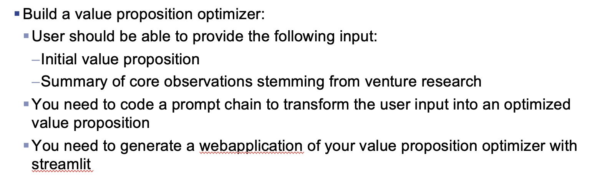
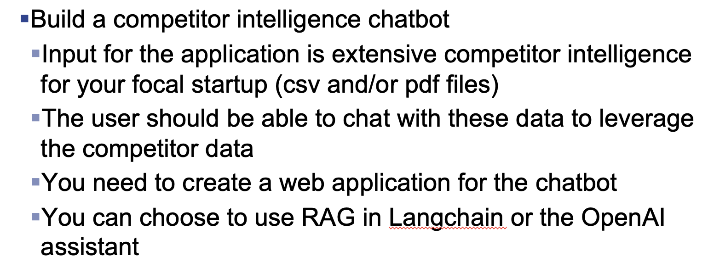

# DDE

This repository is for my university course Data Driven Entrepreneurship. Mainly it is about the final group assignment. It will include mainly .py files.

The structure of the repository is as follows:
- The main files folder contains the two main working files of the assignment 'competitorchatbot.py' and 'value_proposition_optimizer.py'
- - Inside the folder is another folder 'Test Files' this folder is just used to test feauters for both of the assignments

- The 'LLM Tuts' folder just contains two files where I stared to try out langchain and streamlit

- The 'competitorchatbot_v2' folder file contains my visison for the 'competitorchatbot.py' inside the 'Main Files' folder

In the following are two screenshots of my assignment instuctions:

## Instuctions Value Proposition Optimizer

## Instructions Competitor Chatbot

